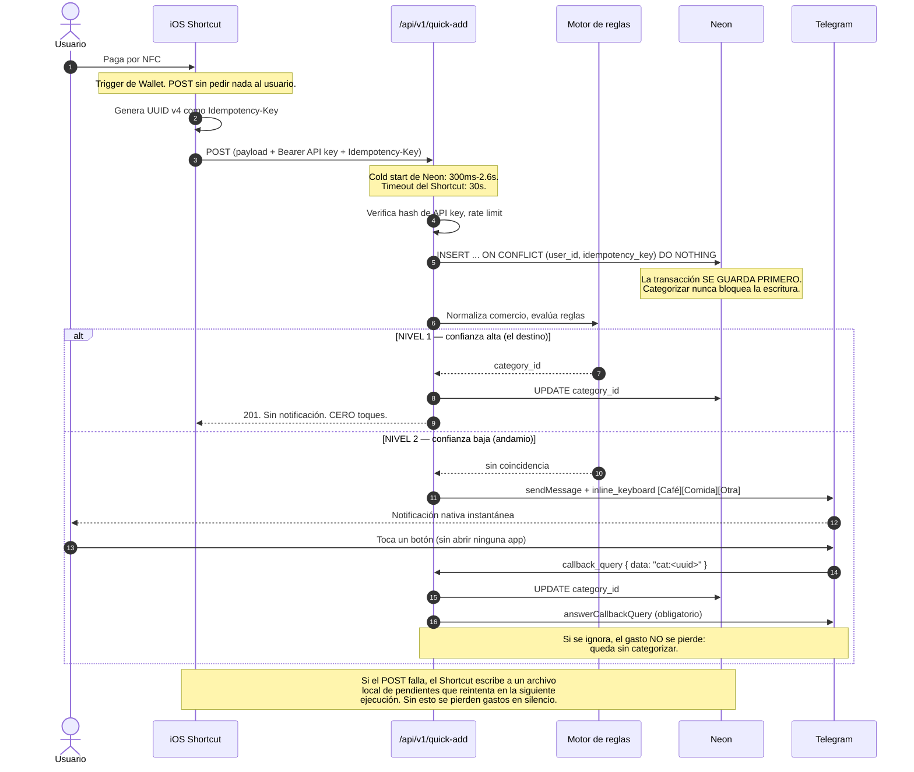

# Especificación Técnica y Arquitectura del Sistema
## RealMoney — Gestión Financiera Personal con Ingesta Asistida por IA

**Versión:** 3.2.0
**Fecha:** 25 de septiembre de 2026
**Estado:** En producción con 3 usuarios reales. Fases 1 y 4 construidas; orden de lo que sigue en `IMPLEMENTATION_PLAN.md` §4.5
**Autor:** Jean Paul Reales
**Documentos hermanos:** `IMPLEMENTATION_PLAN.md` (cómo y en qué orden) · `AUDIT.md` (defectos de la v1) · `METRICS.md` (mediciones)

> **Alcance de este documento.** Aquí vive *qué* se construye: arquitectura, stack, modelo de datos, seguridad, flujos. El *cómo y en qué orden* —bloques, preguntas de control, criterios de decisión— vive en `IMPLEMENTATION_PLAN.md`. Si los dos se contradicen, gana el plan y este documento se corrige.

> **Nota sobre el estado.** Este documento no está "aprobado para implementación". La Fase 0 debe ejecutarse y arrojar un resultado medible antes de comprometer el alcance de la ingesta automática. Un spec en estado aprobado es uno cuyas suposiciones ya se verificaron.

**Cambios v2.0 → v3.0:** arquitectura de captura en tres niveles con cliente de Telegram · Google añadido a autenticación · roadmap ampliado a ocho fases (insights y RAG separados de multi-tenant) · nueva sección de principios **P1-P9** · nueva sección de plataforma (PWA vs nativo, rendimiento, descubrimiento) · `telegram_chat_id` y tabla de logros en el modelo de datos.

**Cambios v3.0 → v3.1 (respuesta a auditoría externa `auditoria_gm.md` + revisión propia del DDL):**

| # | Corrección | Origen |
| :--- | :--- | :--- |
| 1 | `transactions.currency`: documentada la cadena de resolución `accounts.currency → profiles.base_currency`. Sin ella, el `quick-add` sin `account_id` producía un INSERT fallido en producción | Revisión propia |
| 2 | `achievements`: `UNIQUE (user_id, code)` hacía los logros irrepetibles, contradiciendo **P1**. Ahora `UNIQUE NULLS NOT DISTINCT (user_id, code, period_key)` | Revisión propia |
| 3 | `idx_tx_dedupe`: faltaba `merchant_normalized`, así que no soportaba la consulta de deduplicación de §6 | Revisión propia |
| 4 | `categorized_by`: añadido `'shortcut_menu'`. Sin él el Nivel 3 no tenía valor válido y rompía la métrica de distribución por nivel | Revisión propia |
| 5 | Coste del Nivel 2 corregido de "1 toque" a **2 gestos** (pulsación larga + toque). La cifra anterior era optimista | Auditoría externa |
| 6 | Nueva **§3.6**: orden obligatorio de respuesta del `callback_query` (`answerCallbackQuery` inmediato, edición de mensaje para el resultado real, idempotencia ante reintentos) | Auditoría externa, con corrección |
| 7 | Fricción verificada de Zod v4 con `drizzle-zod` y `@hookform/resolvers`, con issues concretos. Fijar versiones exactas en B1 | Auditoría externa, verificado |
| 8 | Nueva decisión abierta §10.3: medir los gestos reales del Nivel 2 en la Fase 0 | Auditoría externa |

**Cambios v3.1 → v3.2 (usuarios reales, 25-sep-2026):**

| # | Corrección | Origen |
| :--- | :--- | :--- |
| 1 | §4.2: las filas del OCR van a un **staging propio** y se **reconcilian** contra lo que ya entró; ya no se insertan como `pending_review` en `transactions` | Plan de Fase 2 |
| 2 | §4.2: los PDF (con contraseña incluida) se convierten en imágenes **en el teléfono**; la clave nunca sale del dispositivo | Plan de Fase 2 |
| 3 | §2 y §8.1: Upstash diferido a la Fase 7; la cuota se cuenta en la base | Plan de Fase 2 |
| 4 | §2 y §8.3: Gemini **solo en plan de pago**: el gratuito puede usar los datos para mejorar productos de Google, inaceptable con datos de terceros | Usuarios reales |
| 5 | §8.1: coste real de WhatsApp verificado. Los mensajes dentro de la ventana de 24 h son gratis; la afirmación de que se cobrarían desde el 1-oct-2026 era incorrecta | Verificación contra Meta |
| 6 | §8.3 y §9: la Ley 1581 aplica **desde ahora** (bloque H1), no desde la Fase 7 | Usuarios reales |
| 7 | §2: Next.js 16 y Neon Auth con OTP por correo, como ya estaba en `CLAUDE.md` | Sincronización |

*No adoptado:* el cron de ping para mantener Neon caliente. Contradice el presupuesto de 100 CU-h/mes del free tier que la propia auditoría cita. Se reconsiderará solo con una medición que lo justifique.

---

## 1. Visión y Alcance Honesto

### 1.1 El Problema
Llevar registro manual de gastos personales falla por fricción operativa: abrir la app tras cada compra, esperar la carga, seleccionar cuenta, escribir el monto, buscar categoría, guardar. Las compras pequeñas se olvidan y el balance de fin de mes no cuadra.

*(Nota: la v1 afirmaba un "90% de abandono en dos semanas" sin fuente. Se elimina la cifra. El problema es real y personal; no necesita una estadística inventada para justificarse.)*

### 1.2 La Solución

**El objetivo no es "un toque": es ninguno.** La arquitectura de captura tiene tres niveles, diseñados para que el Nivel 1 absorba la mayoría de transacciones con el tiempo.

| Nivel | Mecanismo | Toques | Rol |
| :--- | :--- | :--- | :--- |
| **1** | Auto-categorización silenciosa: el Shortcut hace POST sin pedir nada, el motor de reglas asigna categoría con confianza alta y se guarda | **0** | **El destino.** Tras unas semanas, "Éxito" siempre es Supermercado |
| **2** | Telegram con inline keyboard: cuando el motor no tiene confianza, llega notificación nativa con botones de categoría | **2 gestos** | **Andamio** mientras el motor aprende. Su frecuencia debe *caer* |
| **3** | Menú en el propio Shortcut, en el instante del pago | 1 + apertura | Opción, no default. **Abre Shortcuts en primer plano** |

**Regla de diseño crítica:** la transacción se guarda **antes** de enviar cualquier mensaje. El botón solo asigna categoría. Si se ignora la notificación, el gasto no se pierde: queda sin categorizar. Perder un gasto es mucho peor que tenerlo sin etiqueta.

**Corrección sobre el coste real del Nivel 2 (auditoría externa, 24-ago-2026).** En iOS los botones inline son *contenido del mensaje*, no acciones de notificación: el banner no los expone directamente. El flujo real es **pulsación larga (Haptic Touch) para expandir → toque en la categoría**: dos gestos, no uno. Sigue sin abrir ninguna app y sigue siendo muy superior a entrar a la PWA, pero la cifra de "1 toque" era optimista. **Pendiente de medición empírica** — ver §10.3 y `METRICS.md`.

Y por debajo, dos mecanismos de respaldo que cubren lo que el NFC no ve:

- **Ingesta por captura de pantalla (Vision AI).** Subes el extracto; el sistema extrae las transacciones y las presenta para revisión por lotes. **Cobertura retroactiva cercana al 100%** de lo que aparezca en el extracto.
- **Entrada manual rápida y por texto en Telegram.** Tres campos y un botón en la PWA, o `12000 juan valdez` en el chat. Es el suelo garantizado para efectivo, QR y transferencias.

### 1.3 Cobertura Real de la Captura Automática (verificado, agosto 2026)

Esta tabla es la corrección más importante frente a la v1, que afirmaba eliminar "el 95% de la fricción".

| Mecanismo | Qué captura | Qué NO captura |
| :--- | :--- | :--- |
| **Automatización de Wallet** (iOS 17+, renombrada "Wallet" en iOS 26) | Pagos NFC con tarjetas en Apple Wallet. Expone comercio, monto y tarjeta como entrada. Bancolombia soporta Apple Pay en Colombia (Visa/Mastercard/Amex). | Compras web e in-app. Efectivo. Nequi/QR. PSE. Transferencias. Tarjeta física sin NFC. |
| **Automatización de SMS** | SMS bancarios que lleguen como mensaje de texto, con parseo por regex. | Notificaciones push de la app del banco (iOS no permite leerlas). Correos (no hay trigger de email). |

**Limitaciones documentadas de la automatización de Wallet:**
- **Solo NFC.** No dispara en compras online ni dentro de apps.
- **Dispara en transacciones rechazadas.** Requiere lógica de reversión o confirmación diferida.
- **Timeouts.** El emisor de la tarjeta notifica a Wallet con retraso (horas en algunos casos) y el trigger de Shortcuts expira antes. Bugs abiertos: FB14035016, FB16379100. Sin respuesta de Apple a diciembre de 2025. Afecta especialmente a tarjetas Mastercard.
- **La acción `Mostrar notificación` de Shortcuts es explícitamente no accionable:** no admite botones ni personalización. Por eso el Nivel 2 usa Telegram — ver §12.2.

**Consecuencia de diseño:** la ingesta automática se trata como *best-effort*. Toda transacción que entre por ese canal es reconciliable contra el extracto mensual vía OCR. El sistema nunca asume que el canal automático es completo.

### 1.4 Criterio de Éxito (define si esto sigue)
- **Personal:** ≥70% de mis transacciones de 4 semanas consecutivas capturadas sin entrada manual completa, y sigo abriendo el dashboard ≥3 veces por semana en la semana 6.
- **Producto:** solo si se cumple el criterio personal durante 8 semanas se considera abrir a terceros. Antes de eso, "SaaS" es una hipótesis, no un requisito.

---

## 2. Pila Tecnológica y Contrapartidas

Cada fila incluye la contrapartida. Una tabla de stack sin columna de costos es material de marketing.

| Capa | Tecnología | Por qué | Contrapartida asumida |
| :--- | :--- | :--- | :--- |
| **Framework** | Next.js 16 (App Router) | Un solo repo para PWA y endpoints. Server Components reducen JS en cliente. | El App Router tiene aristas (caching, `use client`). **Runtime Node, región `iad1`** — no Edge global: la DB vive en una región y distribuir el cómputo empeora la latencia. |
| **Lenguaje** | TypeScript 5+ (strict) | Tipado extremo a extremo sobre operaciones monetarias. | Ninguna relevante. |
| **Base de datos** | **Neon (PostgreSQL serverless)** | Postgres real. **Branching**: cada PR y cada migración se prueba contra una copia instantánea de producción — la ventaja decisiva frente a Supabase para este proyecto. Free tier: 100 proyectos, 100 CU-h/proyecto/mes, 0.5 GB. | **Cold start de 300ms a ~2.6s (p95)** tras auto-suspensión (5 min por defecto). Impacto directo en el webhook de ingesta — ver §4.3. En free tier no puedes mantenerlo caliente: 730 h/mes excede las 100 CU-h. |
| **ORM** | Drizzle ORM | Type-safe, sin capa de runtime pesada, migraciones SQL legibles. | **`drizzle-orm/neon-http` no soporta transacciones.** El batch-create de OCR las necesita → decisión tomada: **`drizzle-orm/neon-serverless`** (WebSocket). |
| **Autenticación** | **Neon Auth (Managed Better Auth)** | Better Auth gestionado. Métodos: **código de un solo uso por correo + Google** (Neon Auth no tiene magic link; verificado el 27-ago-2026). Crea tablas reales en la propia base, consultables con Drizzle. Migrable a Better Auth autoalojado. | IDs de usuario **UUID**. **Apple es obligatorio** si se ofrece Google y algún día se empaqueta para App Store; diferido hasta entonces. |
| **Mensajería** | **Telegram Bot API** · **WhatsApp Cloud API** (bloque W1) | Telegram: inline keyboards, gratis, contenido dinámico sin plantillas. WhatsApp: el canal que los usuarios ya tienen abierto; lo que abre el usuario es gratis. | Telegram exige tenerlo instalado. WhatsApp: fuera de la ventana de 24 h solo plantillas aprobadas, con botones fijos — la pregunta de categoría cuesta 3 gestos, no 2 (ver §8.1). |
| **Almacenamiento de archivos** | **Cloudflare R2** (bucket privado + signed URLs) | Neon no tiene object storage. R2 no cobra egreso. | Un servicio más que configurar. Los recibos **nunca** se sirven por URL pública. |
| **Estilos & UI** | Tailwind CSS v4 + Radix UI + Lucide | Sistema de diseño sin overhead en runtime. Radix aporta accesibilidad real. | **Framer Motion queda fuera de la v1** (~50KB gz contra el presupuesto de **P7**). **Glassmorphism queda fuera de la lista de transacciones**: `backdrop-filter` con scroll largo en Safari iOS destruye el framerate justo en la pantalla principal. Se permite en tarjetas estáticas. |
| **PWA** | Serwist + Web App Manifest | Instalación en pantalla de inicio, pantalla completa, caché offline. | iOS no soporta Background Sync ni Background Fetch, y el push web exige instalación. **No importa:** la captura no pasa por la PWA — ver §12.1. |
| **Visión / OCR y lenguaje** | Google Gemini Flash / Flash-Lite **en plan de pago**, por REST | Un solo adaptador (`infrastructure/ai/gemini.ts`) para el OCR (Fase 2) y para entender texto libre en el chat (bloque L1). Salida estructurada por schema. | Latencia real **2–6s** en visión. El schema que acepta es un subconjunto: se verifica contra el modelo antes de fijarlo. Envías datos financieros a un tercero — ver §8.3. El plan gratuito queda descartado: puede usar lo enviado para mejorar productos de Google. |
| **Validación** | **Zod v4** | `z.toJSONSchema()` nativo, necesario para la salida estructurada de Gemini sin conversión manual. | **Fricción verificada en el ecosistema, a comprobar en B1 antes de fijar `package.json`:** `drizzle-zod` 0.8.3 con `coerce: true` convierte `number` y `date` en `unknown` ([drizzle-orm#5659](https://github.com/drizzle-team/drizzle-orm/issues/5659)). `@hookform/resolvers` soporta v3.25+ y v4.0+ en runtime, pero ciertos pares de versiones fallan el overload a nivel de tipos ([resolvers#842](https://github.com/react-hook-form/resolvers/issues/842)). Fijar versiones exactas, no rangos. |
| **Regex segura** | **`node-re2`** | RE2 no hace backtracking: garantiza tiempo lineal sobre patrones de usuario. | Dependencia nativa. Si no está disponible en el entorno de despliegue, se elimina la opción de regex — ver §3.4. |
| **Rate limiting** | Cuota contada en la propia base; **Upstash diferido a la Fase 7** | El endpoint de OCR cuesta dinero por invocación. Con pocos usuarios, un `COUNT` de importaciones del día basta. | Con muchos usuarios concurrentes el conteo en base deja de ser suficiente; ahí entra Upstash. |
| **Observabilidad** | Sentry + logs estructurados | Una ingesta que falla en silencio es peor que un error visible. | — |

---

## 3. Modelo de Seguridad

La v1 afirmaba que RLS *"garantiza que ningún usuario acceda a datos de otro a nivel de motor de base de datos"*. Con Drizzle conectándose por TCP con un rol propietario, las políticas RLS no se evalúan y esa garantía no existe. Peor: el endpoint de ingesta se autentica con API key, sin JWT, así que tampoco había identidad que evaluar.

### 3.1 Defensa primaria: aislamiento por capa de repositorio

**Regla arquitectónica no negociable:** ninguna consulta a las tablas de dominio se escribe fuera de `src/core/repositories/`. Toda función de repositorio recibe `userId` como **primer parámetro obligatorio**, tipado como un branded type:

```typescript
type UserId = string & { readonly __brand: 'UserId' };

// El tipo hace imposible olvidar el scope: no hay overload sin userId.
export async function listTransactions(
  userId: UserId,
  filters: TransactionFilters
): Promise<Transaction[]> {
  return db.select().from(transactions)
    .where(and(eq(transactions.userId, userId), isNull(transactions.deletedAt), ...));
}
```

Se refuerza con un test de arquitectura en CI que falla si aparece un `db.` fuera de la carpeta de repositorios.

### 3.2 Defensa secundaria: RLS con `pg_session_jwt` (Fase 7)

Neon soporta RLS mediante la extensión `pg_session_jwt`, que expone `auth.user_id()` en las políticas. Se adopta **cuando se abra a terceros**, no antes, y con dos condiciones:
- Conexión con un rol **sin** `BYPASSRLS`.
- Advertencia de la propia documentación de Neon: sin validación JWK, `request.jwt.claims` es un parámetro de Postgres modificable por cualquier usuario de base de datos. Debe usarse la ruta con JWK validado.

Hasta entonces, RLS se mantiene **activado y escrito**, pero se documenta explícitamente como defensa en profundidad y no como la barrera primaria. La diferencia entre esta versión y la v1 no es el código: es no mentirse sobre qué te protege.

### 3.3 API Keys

La v1 guardaba una key en texto plano en `profiles`. Un volcado de esa tabla entregaba acceso de escritura a todas las cuentas.

- Tabla `api_keys` separada, múltiples keys por usuario, revocables.
- Se almacena **`sha256(key)`**, nunca la key.
- Formato `rm_live_<32 bytes hex>`, generado en Node con `crypto.randomBytes`. Se muestra **una sola vez**.
- Campos de auditoría: `last_used_at`, `revoked_at`, `expires_at`.
- Rate limit por key: 60 req/min. Cuota de OCR: 50 imágenes/día.

### 3.4 ReDoS en reglas de categorización

`merchant_pattern` con `is_regex = TRUE` permite al usuario inyectar una regex catastrófica que bloquea el event loop. Mitigación: **las regex se ejecutan con `node-re2`** (sin backtracking, tiempo lineal garantizado). Si RE2 no está disponible en el entorno de despliegue, se elimina la opción de regex y solo se admite substring.

### 3.5 Webhook de Telegram

- El endpoint de `callback_query` valida el `secret_token` configurado en `setWebhook` (cabecera `X-Telegram-Bot-Api-Secret-Token`).
- El `chat_id` entrante se resuelve contra `profiles.telegram_chat_id`; un chat no vinculado se descarta sin procesar.
- El payload del botón (1-64 bytes UTF-8) transporta `cat:<uuid>`; el `transaction_id` se resuelve en servidor, nunca se confía en el cliente.

### 3.6 Orden de respuesta del `callback_query`

Sumando el cold start de Vercel y el de Neon (300ms–2.6s p95), la escritura puede tardar. Telegram deja el botón con spinner hasta que llega `answerCallbackQuery` — la documentación admite **hasta un minuto** si nunca se responde.

**Patrón obligatorio:**

```typescript
// 1. Matar el spinner PRIMERO. No esperar a la base de datos.
await answerCallbackQuery(query.id);           // ack neutro, sin texto de exito

// 2. Escribir despues.
const result = await categorize(userId, txId, categoryId);

// 3. Reflejar el resultado REAL editando el mensaje.
await editMessageText(chatId, messageId,
  result.ok ? `✅ ${merchant} → ${categoryName}`
            : `⚠️ No se pudo guardar. Toca para reintentar.`);
```

**Por qué el paso 3 no es opcional.** Responder primero y escribir después abre una ventana en la que ya le dijiste "recibido" al usuario sobre algo que puede fallar. El ack neutro no afirma éxito; la edición del mensaje es la que comunica el resultado verdadero. Sin ese paso, un fallo de escritura queda invisible y el usuario cree que categorizó cuando no lo hizo.

**Reintentos de Telegram.** Si el Route Handler no responde 200, Telegram reintenta el webhook. El handler debe ser idempotente sobre `callback_query.id`: reasignar la misma categoría dos veces es inofensivo, pero no debe duplicar efectos secundarios (logros, contadores de `hit_count`).

---

## 4. Arquitectura y Flujos

### 4.1 Estructura del proyecto

Se descarta el Repository + Unit of Work sobre Drizzle de la v1: Drizzle **ya es** la capa de acceso a datos y no vas a cambiar de Postgres. Lo que sí se conserva es el aislamiento de la lógica de negocio para poder testearla sin base de datos.

```
src/
├── app/
│   ├── (auth)/
│   ├── (dashboard)/
│   ├── api/v1/
│   │   ├── quick-add/route.ts              # Webhook del Shortcut
│   │   ├── telegram/webhook/route.ts       # callback_query + mensajes
│   │   ├── ocr/parse-statement/route.ts
│   │   ├── transactions/batch-create/route.ts
│   │   └── export/route.ts
│   ├── manifest.ts · robots.ts · sitemap.ts
├── components/{ui,dashboard,ocr}/
├── clients/
│   └── telegram/                   # Cliente delgado. CERO lógica de negocio (P9).
├── core/
│   ├── money.ts                    # Aritmética monetaria. 100% cubierta por tests.
│   ├── categorization.ts           # Motor de reglas. Función pura, testeable sin DB.
│   ├── idempotency.ts
│   ├── repositories/               # ÚNICO lugar con acceso a `db`. Scope por userId.
│   └── services/                   # Toda capacidad vive aquí. La usan PWA y Telegram.
│       ├── ingestion.service.ts
│       ├── ocr.service.ts
│       ├── analytics.service.ts
│       └── notification.service.ts # Agnóstico del proveedor
├── infrastructure/
│   ├── db/ · ai/gemini.ts · storage/r2.ts
│   ├── messaging/                  # Adaptadores: telegram.ts, whatsapp.ts (Fase 7)
│   └── sms-parsers/                # Strategy por banco.
└── lib/telemetry.ts
```

### 4.2 Flujo de OCR

```mermaid
sequenceDiagram
    autonumber
    actor Usuario
    participant PWA
    participant R2 as Cloudflare R2
    participant API as /api/v1/statements/[id]/extract
    participant AI as Gemini Flash
    participant DB as Neon Postgres

    Usuario->>PWA: Elige el PDF del extracto o fotos
    PWA->>PWA: PDF con clave: se pide y se abre AQUÍ (pdf.js)
    PWA->>PWA: Cada página a WebP ≤1600 px
    PWA->>R2: Sube vía URL firmada (no pasa por Vercel)
    PWA->>API: Extraer
    API->>API: Cuota del día (contada en la base)
    API->>AI: Imágenes + schema (Zod v4 -> JSON Schema)
    Note over AI: 2-6 s por página. Progreso en streaming.
    AI-->>API: Filas con monto COMO TEXTO y confidence
    API->>API: Zod + money.ts + cross-check contra el total
    API->>DB: Reconciliar contra transactions del rango
    API->>DB: statement_rows: ya estaba / nueva / dudosa
    API-->>PWA: Filas agrupadas
    PWA->>Usuario: Nuevas primero; dudosas exigen toque; ya estaban colapsadas
    Usuario->>PWA: Confirma
    PWA->>DB: UNA transacción: INSERT de las aceptadas (idempotency_key = id de la fila)
```

**Por qué un staging y no `pending_review` en `transactions`** (cambio de v3.2): la mayoría de filas de un extracto ya existen, porque entraron por SMS. Meterlas en `transactions` para después borrarlas ensucia el ledger, el índice de duplicados y el motor de reglas. Una fila extraída no es una transacción hasta que el usuario la confirma.

**Control de alucinación** (ausente en la v1, que proponía "confirmación en 1 solo clic" sobre datos de un LLM que representan dinero):
- `confidence` por fila devuelto por el modelo.
- El monto llega como **texto** y lo convierte `core/money.ts`: un número JSON del modelo ya es un double.
- Cross-check aritmético contra el total del extracto cuando sea visible. Descuadre → banner de advertencia.
- Reconciliación contra transacciones ya existentes: mismo monto, fecha ±2 días, comercio parecido. Dos candidatos para una fila → dudosa, nunca adivina.
- Las filas con `confidence < 0.85` o dudosas **no** se incluyen en "confirmar todas"; requieren toque individual.

**La revisión de OCR vive solo en la PWA.** Un chat es lineal y no se puede escanear; revisar 40 filas en Telegram sería peor. Ver **P9**.

### 4.3 Flujo de captura en tres niveles (Fase 4)



**El Nivel 2 es andamio, no destino.** Su frecuencia debe **caer** conforme el motor de reglas aprende. Si a los seis meses sigue haciendo falta tocar un botón en cada transacción, el motor falló. De ahí que la tasa de auto-categorización sea la métrica central de la Fase 4 (`METRICS.md`).

---

## 5. Modelo de Datos

```sql
-- IDs de usuario: TEXT, porque Better Auth / Neon Auth no usa UUID.
-- CORRECCION (B1.b, 25-ago-2026): las claves primarias usan uuidv7(), nativo en
-- PG18, y no gen_random_uuid(). Un v4 es aleatorio y cada insercion cae en un
-- punto arbitrario del indice, fragmentandolo; un v7 lleva prefijo temporal, asi
-- que las filas nuevas entran ordenadas por el extremo derecho del btree. Es
-- gratis y estrictamente mejor en las tablas con volumen de escritura.
-- Las POLITICAS RLS de mas abajo NO se crean en la Fase 1: leen auth.user_id(),
-- que viene de pg_session_jwt (Fase 7), y CREATE POLICY falla si la funcion no
-- existe. RLS queda ACTIVADO en las ocho tablas; solo faltan las politicas.
-- Las API keys se generan y hashean en Node, no en SQL.

-- Trigger reutilizable: sin esto, updated_at nunca cambia (bug de la v1).
CREATE OR REPLACE FUNCTION set_updated_at() RETURNS TRIGGER AS $$
BEGIN NEW.updated_at = NOW(); RETURN NEW; END;
$$ LANGUAGE plpgsql;

-- 1. Perfiles. Sin FK dura contra neon_auth.users_sync (sincronización asíncrona).
CREATE TABLE public.profiles (
    id                TEXT PRIMARY KEY,
    email             TEXT NOT NULL,
    full_name         TEXT,
    base_currency     CHAR(3) NOT NULL DEFAULT 'COP',
    timezone          TEXT NOT NULL DEFAULT 'America/Bogota',
    telegram_chat_id  BIGINT UNIQUE,      -- Vinculación del bot. NULL = no vinculado.
    created_at        TIMESTAMPTZ NOT NULL DEFAULT NOW(),
    updated_at        TIMESTAMPTZ NOT NULL DEFAULT NOW()
);
CREATE TRIGGER trg_profiles_updated BEFORE UPDATE ON public.profiles
  FOR EACH ROW EXECUTE FUNCTION set_updated_at();

-- 2. API Keys: hasheadas, revocables, auditables.
CREATE TABLE public.api_keys (
    id           UUID PRIMARY KEY DEFAULT gen_random_uuid(),
    user_id      TEXT NOT NULL REFERENCES public.profiles(id) ON DELETE CASCADE,
    name         VARCHAR(60) NOT NULL,
    key_hash     CHAR(64) NOT NULL UNIQUE,   -- sha256 hex. NUNCA la key en claro.
    key_prefix   VARCHAR(16) NOT NULL,       -- 'rm_live_a1b2' para identificarla en la UI
    last_used_at TIMESTAMPTZ,
    expires_at   TIMESTAMPTZ,
    revoked_at   TIMESTAMPTZ,
    created_at   TIMESTAMPTZ NOT NULL DEFAULT NOW()
);
CREATE INDEX idx_api_keys_user ON public.api_keys(user_id) WHERE revoked_at IS NULL;

-- 3. Cuentas. Sin current_balance denormalizado: se calcula (ver 5.1).
CREATE TABLE public.accounts (
    id                    UUID PRIMARY KEY DEFAULT gen_random_uuid(),
    user_id               TEXT NOT NULL REFERENCES public.profiles(id) ON DELETE CASCADE,
    name                  VARCHAR(100) NOT NULL,
    type                  VARCHAR(30) NOT NULL
                          CHECK (type IN ('checking','credit_card','savings','cash','digital_wallet')),
    currency              CHAR(3) NOT NULL DEFAULT 'COP',
    initial_balance_minor BIGINT NOT NULL DEFAULT 0,
    color                 VARCHAR(20) NOT NULL DEFAULT '#3B82F6',
    is_archived           BOOLEAN NOT NULL DEFAULT FALSE,
    created_at            TIMESTAMPTZ NOT NULL DEFAULT NOW(),
    updated_at            TIMESTAMPTZ NOT NULL DEFAULT NOW(),
    CONSTRAINT uq_accounts_name UNIQUE (user_id, name)
);
CREATE TRIGGER trg_accounts_updated BEFORE UPDATE ON public.accounts
  FOR EACH ROW EXECUTE FUNCTION set_updated_at();

-- 4. Categorías.
CREATE TABLE public.categories (
    id          UUID PRIMARY KEY DEFAULT gen_random_uuid(),
    user_id     TEXT NOT NULL REFERENCES public.profiles(id) ON DELETE CASCADE,
    name        VARCHAR(80) NOT NULL,
    icon        VARCHAR(50) NOT NULL DEFAULT 'Tag',
    color       VARCHAR(20) NOT NULL DEFAULT '#6B7280',
    type        VARCHAR(10) NOT NULL CHECK (type IN ('expense','income')),
    created_from_seed BOOLEAN NOT NULL DEFAULT FALSE,  -- nombre honesto: son copias por usuario
    created_at  TIMESTAMPTZ NOT NULL DEFAULT NOW(),
    CONSTRAINT uq_categories UNIQUE (user_id, name, type)
);
CREATE INDEX idx_categories_user ON public.categories(user_id);

-- 5. Presupuestos POR PERIODO. En la v1 vivían en `categories` como valor unico,
--    lo que reescribia retroactivamente la historia de meses anteriores.
CREATE TABLE public.budgets (
    id           UUID PRIMARY KEY DEFAULT gen_random_uuid(),
    user_id      TEXT NOT NULL REFERENCES public.profiles(id) ON DELETE CASCADE,
    category_id  UUID NOT NULL REFERENCES public.categories(id) ON DELETE CASCADE,
    period_start DATE NOT NULL,          -- primer dia del mes, en zona del usuario
    amount_minor BIGINT NOT NULL CHECK (amount_minor >= 0),
    created_at   TIMESTAMPTZ NOT NULL DEFAULT NOW(),
    CONSTRAINT uq_budget UNIQUE (user_id, category_id, period_start)
);

-- 6. Transacciones.
CREATE TABLE public.transactions (
    id                UUID PRIMARY KEY DEFAULT gen_random_uuid(),
    user_id           TEXT NOT NULL REFERENCES public.profiles(id) ON DELETE CASCADE,
    account_id        UUID REFERENCES public.accounts(id) ON DELETE SET NULL,
    category_id       UUID REFERENCES public.categories(id) ON DELETE SET NULL,

    -- Dinero: unidades menores, escala 100 SIEMPRE. $45.000 COP = 4500000.
    -- (COP no usa centavos en la practica; la escala fija simplifica multi-moneda.)
    amount_minor      BIGINT NOT NULL CHECK (amount_minor > 0),
    -- Sin esto, SUM() mezcla monedas. NOT NULL sin default a proposito: obliga a
    -- resolverla explicitamente. La capa de servicio la deriva en este orden:
    --   accounts.currency (si hay account_id)  ->  profiles.base_currency  (fallback)
    -- El quick-add del Shortcut NO trae account_id, asi que sin esta regla el INSERT
    -- falla en produccion. Ver `resolveCurrency()` en core/services/ingestion.service.ts.
    currency          CHAR(3) NOT NULL,

    type              VARCHAR(10) NOT NULL CHECK (type IN ('expense','income','transfer')),

    -- Faltaba en v1 pese a usarse en los diagramas.
    -- pending_auth: autorizacion de credito, el monto puede cambiar al liquidar.
    status            VARCHAR(20) NOT NULL DEFAULT 'confirmed'
                      CHECK (status IN ('confirmed','pending_review','pending_auth','declined')),

    merchant          VARCHAR(255) NOT NULL CHECK (length(trim(merchant)) > 0),
    merchant_normalized VARCHAR(255),
    note              TEXT,
    transaction_date  TIMESTAMPTZ NOT NULL,

    source            VARCHAR(30) NOT NULL
                      CHECK (source IN ('wallet_nfc','sms_shortcut','ocr_screenshot',
                                        'manual','telegram_text','csv_import')),
    idempotency_key   UUID,               -- generada por el CLIENTE. No es un hash temporal.
    ocr_confidence    NUMERIC(3,2),

    -- Nivel de captura que resolvio la categoria. Alimenta la metrica central de Fase 4.
    -- 'rule_engine' = Nivel 1 (0 gestos) · 'telegram' = Nivel 2 · 'shortcut_menu' = Nivel 3.
    -- Sin 'shortcut_menu' el Nivel 3 no tenia valor valido y rompia la metrica de
    -- distribucion por nivel de METRICS.md.
    categorized_by    VARCHAR(20) CHECK (categorized_by IN
                      ('rule_engine','telegram','shortcut_menu','manual','ocr')),

    -- Transferencias: dos patas ligadas. En v1 el modelo era imposible con un solo account_id.
    transfer_group_id UUID,

    receipt_object_key TEXT,              -- clave en R2, NO una URL publica
    deleted_at        TIMESTAMPTZ,        -- soft delete: app de dinero, nada se borra duro
    created_at        TIMESTAMPTZ NOT NULL DEFAULT NOW(),
    updated_at        TIMESTAMPTZ NOT NULL DEFAULT NOW()
);
CREATE TRIGGER trg_tx_updated BEFORE UPDATE ON public.transactions
  FOR EACH ROW EXECUTE FUNCTION set_updated_at();

-- UNIQUE, no solo un indice. Sin esto, dos peticiones concurrentes insertan las dos
-- (TOCTOU) — exactamente el caso que la idempotencia debia cubrir.
CREATE UNIQUE INDEX idx_tx_idempotency ON public.transactions(user_id, idempotency_key)
  WHERE idempotency_key IS NOT NULL;

CREATE INDEX idx_tx_user_date  ON public.transactions(user_id, transaction_date DESC)
  WHERE deleted_at IS NULL;
CREATE INDEX idx_tx_user_cat   ON public.transactions(user_id, category_id)
  WHERE deleted_at IS NULL;          -- consulta principal del dashboard, faltaba en v1
CREATE INDEX idx_tx_transfer   ON public.transactions(transfer_group_id)
  WHERE transfer_group_id IS NOT NULL;
-- La deteccion de duplicados de §6 es "mismo monto + comercio + ventana 24h".
-- merchant_normalized DEBE estar en el indice o la consulta no lo usa.
CREATE INDEX idx_tx_dedupe     ON public.transactions
  (user_id, amount_minor, merchant_normalized, transaction_date)
  WHERE deleted_at IS NULL;
CREATE INDEX idx_tx_uncategorized ON public.transactions(user_id, created_at DESC)
  WHERE category_id IS NULL AND deleted_at IS NULL;   -- cola del Nivel 2

-- 7. Reglas de categorización.
CREATE TABLE public.categorization_rules (
    id               UUID PRIMARY KEY DEFAULT gen_random_uuid(),
    user_id          TEXT NOT NULL REFERENCES public.profiles(id) ON DELETE CASCADE,
    category_id      UUID NOT NULL REFERENCES public.categories(id) ON DELETE CASCADE,
    merchant_pattern VARCHAR(255) NOT NULL,
    is_regex         BOOLEAN NOT NULL DEFAULT FALSE,  -- ejecutado SOLO con RE2 (ver 3.4)
    priority         INTEGER NOT NULL DEFAULT 0,
    hit_count        INTEGER NOT NULL DEFAULT 0,      -- cuantas veces acerto: mide el aprendizaje
    created_at       TIMESTAMPTZ NOT NULL DEFAULT NOW()
);
CREATE INDEX idx_rules_user ON public.categorization_rules(user_id, priority DESC);
-- ^ El motor lo consulta en CADA ingesta. Faltaba en v1.

-- 8. Logros. Segun P1: premian COMPORTAMIENTO, nunca montos ni resultados.
CREATE TABLE public.achievements (
    id          UUID PRIMARY KEY DEFAULT gen_random_uuid(),
    user_id     TEXT NOT NULL REFERENCES public.profiles(id) ON DELETE CASCADE,
    code        VARCHAR(50) NOT NULL,   -- 'streak_7d', 'reviewed_statement', 'adjusted_budget'

    -- REPETIBLES. Un UNIQUE(user_id, code) a secas haria que 'streak_7d' solo se
    -- pudiera ganar una vez en la vida, lo que CONTRADICE P1: una racha que solo
    -- cuenta la primera vez no premia consistencia, premia haber empezado.
    -- period_key acota la repeticion: '2026-W34' semanal, '2026-08' mensual,
    -- NULL para los logros que si son de una sola vez (ej. 'first_export').
    period_key  VARCHAR(10),

    earned_at   TIMESTAMPTZ NOT NULL DEFAULT NOW(),
    CONSTRAINT uq_achievement UNIQUE NULLS NOT DISTINCT (user_id, code, period_key)
);
-- NULLS NOT DISTINCT (PG15+): sin esto, varias filas con period_key NULL escaparian
-- del UNIQUE y los logros de una sola vez se podrian duplicar.
-- NO existe tabla de "arquetipo de usuario" visible. Los arquetipos se derivan en
-- consulta y sirven SOLO para enrutar contenido (P1). Nunca se muestran como etiqueta.

-- 9. Log de ingestas fallidas. Sin esto, un webhook que falla pierde el gasto en silencio
--    y erosiona la confianza en todo el dataset.
CREATE TABLE public.ingestion_failures (
    id           UUID PRIMARY KEY DEFAULT gen_random_uuid(),
    user_id      TEXT REFERENCES public.profiles(id) ON DELETE CASCADE,
    source       VARCHAR(30) NOT NULL,
    raw_payload  JSONB NOT NULL,
    error        TEXT NOT NULL,
    resolved_at  TIMESTAMPTZ,
    created_at   TIMESTAMPTZ NOT NULL DEFAULT NOW()
);

-- 10. Corpus del RAG (Fase 6). Requiere: CREATE EXTENSION vector;
-- CREATE TABLE public.knowledge_chunks (
--     id         UUID PRIMARY KEY DEFAULT gen_random_uuid(),
--     source_url TEXT NOT NULL,          -- Banco de la Republica, SFC, Asobancaria, DANE
--     source_title TEXT NOT NULL,
--     content    TEXT NOT NULL,          -- el fragmento literal, para verificar citas (P3)
--     embedding  vector(768),
--     created_at TIMESTAMPTZ NOT NULL DEFAULT NOW()
-- );

-- RLS: activado como defensa en profundidad (ver 3.2). Adoptado de verdad en Fase 7.
-- (select auth.user_id()) entre parentesis: sin el subquery, Postgres reevalua la
-- funcion POR FILA y no aprovecha el indice.
ALTER TABLE public.profiles              ENABLE ROW LEVEL SECURITY;
ALTER TABLE public.accounts              ENABLE ROW LEVEL SECURITY;
ALTER TABLE public.categories            ENABLE ROW LEVEL SECURITY;
ALTER TABLE public.budgets               ENABLE ROW LEVEL SECURITY;
ALTER TABLE public.transactions          ENABLE ROW LEVEL SECURITY;
ALTER TABLE public.categorization_rules  ENABLE ROW LEVEL SECURITY;
ALTER TABLE public.achievements          ENABLE ROW LEVEL SECURITY;
ALTER TABLE public.api_keys              ENABLE ROW LEVEL SECURITY;

CREATE POLICY tx_owner ON public.transactions FOR ALL TO authenticated
  USING ((select auth.user_id()) = user_id)
  WITH CHECK ((select auth.user_id()) = user_id);
-- (idem para el resto de tablas)
```

### 5.1 Nota sobre el balance de cuentas

La v1 tenía `current_balance_cents` como columna, sin especificar cómo se mantenía: se desincroniza en el primer edit, delete o transferencia. Se elimina. El balance se calcula:

```sql
SELECT a.initial_balance_minor
     + COALESCE(SUM(CASE WHEN t.type='income'  THEN t.amount_minor
                         WHEN t.type='expense' THEN -t.amount_minor END), 0)
FROM accounts a LEFT JOIN transactions t
  ON t.account_id = a.id AND t.deleted_at IS NULL AND t.status = 'confirmed'
WHERE a.id = $1 GROUP BY a.id;
```

Con un índice y unos miles de filas esto es instantáneo. Se añadirá caché **cuando una medición lo justifique**, no antes.

---

## 6. Fiabilidad Financiera

| Desafío | Solución |
| :--- | :--- |
| **Precisión monetaria** | Prohibición de `float`/`double`. `BIGINT` en unidades menores, escala 100. Conversión solo en la capa de formateo (`Intl.NumberFormat`). Toda la aritmética vive en `core/money.ts` con cobertura de tests del 100%. |
| **Idempotencia** | **UUID generado por el cliente**, enviado como `Idempotency-Key`, con constraint `UNIQUE` y `ON CONFLICT DO NOTHING`. Determinista y exacto. Sustituye al hash con ventana temporal de la v1, que estaba definido de tres formas distintas (10 min / redondeo a hora / 15 min) y fallaba en los bordes: 10:59 y 11:01 caen en buckets distintos. |
| **Duplicados genuinos** | Problema **separado** de la idempotencia. Detección por similitud (mismo monto + comercio + ventana de 24h) presentada como **sugerencia al usuario**. Nunca descarte automático: dos cafés idénticos seguidos son dos compras reales, y descartarlas silenciosamente le borra dinero al usuario. |
| **Zonas horarias** | Almacenamiento en UTC (`TIMESTAMPTZ`). **Toda agregación por periodo se hace en SQL con `date_trunc('month', transaction_date AT TIME ZONE p.timezone)`.** La v1 decía "conversión en el cliente", lo que rompe los totales: un gasto del 31 de agosto a las 20:00 en Bogotá es 1 de septiembre en UTC, y el cliente no puede arreglar una suma ya mal agrupada. |
| **SMS con formato cambiante** | Strategy por banco con regex versionadas. Si el parseo falla, el texto crudo va a Gemini Flash como fallback (**latencia real 1–3s**, no los <200ms que afirmaba la v1 — imposible para una llamada de red a un LLM) y la transacción entra como `pending_review`. Si también falla, se registra en `ingestion_failures`. |
| **Transacciones rechazadas** | El trigger de Wallet dispara en rechazos. Entran como `status='declined'`, excluidas de todo cálculo, visibles para revisión. |
| **Autorización vs liquidación** | Los cargos de crédito cambian de monto al liquidar (propinas, hoteles, gasolineras). `status='pending_auth'` y reconciliación contra el extracto vía OCR. |
| **Cold start de Neon** | El Shortcut usa timeout de 30s. Si aun así falla, escribe a una lista local de pendientes que reintenta en la siguiente ejecución. |
| **Notificación ignorada** | La transacción se guarda **antes** de enviar el mensaje de Telegram. Ignorar el botón deja el gasto sin categoría, nunca sin registrar. |

---

## 7. Estrategia de Pruebas

Ausente por completo en la v1. En una aplicación de dinero no es opcional.

| Qué | Cómo | Umbral |
| :--- | :--- | :--- |
| **Aritmética monetaria** | Vitest sobre `core/money.ts`. Casos de redondeo, división, cambio de signo. | Cobertura 100%. Bloquea el merge. |
| **Parsers de SMS** | Corpus real de mensajes de Bancolombia/Nequi guardados desde hoy (anonimizados). Un test por formato observado. | Todo formato en producción tiene test. |
| **Motor de categorización** | Función pura, tests de tabla. Incluye casos de ReDoS con patrones catastróficos. | — |
| **Precisión del OCR** | Golden set de ≥20 imágenes reales de extractos con su salida esperada. Métrica: % de campos correctos, desglosada. Se ejecuta ante cada cambio de prompt o de modelo. | Sin regresión frente al baseline de `METRICS.md`. |
| **Aislamiento por usuario** | Tests de integración contra un **branch de Neon**: usuario A no ve nada de usuario B por ningún repositorio. | Obligatorio. |
| **Políticas RLS** | pgTAP sobre un branch de Neon. Una policy sin test es una policy que no sabes si funciona. | Al adoptar la Fase 7. |
| **Arquitectura** | Test en CI que falla si aparece `db.` fuera de `core/repositories/`, o lógica de negocio en `clients/`. | Bloquea el merge. |
| **Rendimiento** | Lighthouse CI con el presupuesto de **P7**. | Bloquea el merge. |
| **Migraciones** | Cada migración se aplica primero a un branch creado desde producción. | Obligatorio antes de aplicar a main. |

El branching de Neon es lo que hace baratas las filas de aislamiento, RLS y migraciones — es la razón principal para elegirlo.

---

## 8. Operación, Costos y Marco Legal

### 8.1 Costos reales
La v1 afirmaba "sin costes de servidor fijo". Es cierto solo hasta cierto punto.

| Servicio | Uso personal | Al abrir a terceros |
| :--- | :--- | :--- |
| Neon | Free (0.5 GB, 100 CU-h/mes) | Launch, ~$0.106/CU-h, sin mínimo mensual |
| Vercel | Hobby | Pro $20/mes |
| **Telegram** | **$0, ilimitado** | **$0, ilimitado** |
| **WhatsApp Cloud API** | ≈ US$0,07/mes con 3 usuarios (estimado) | Gratis lo que abre el usuario y las respuestas dentro de la ventana de 24 h. Se paga la plantilla enviada **fuera** de la ventana: utility ≈ US$0,0008 en Colombia, marketing ≈ US$0,0125 (verificado el 25-sep-2026) |
| Gemini Flash-Lite / Flash (pago) | < US$1/mes con 3 usuarios | Flash-Lite de US$0,10 a US$0,30 por millón de tokens de entrada según versión. Escala con el OCR — **la partida a vigilar**. Alerta de presupuesto en US$5 |
| Cloudflare R2 | Free | ~$0.015/GB-mes, sin egreso |
| Upstash | No se usa (diferido) | ~$10/mes, desde la Fase 7 |

**Punto de ruptura del free tier:** ~0.5 GB de almacenamiento o 100 CU-h/mes. Con scale-to-zero y un usuario, estás lejos. Con 50 usuarios activos, no.

Que Telegram sea gratis e ilimitado es lo que permite que el Nivel 2 mande un mensaje por transacción sin pensar en el coste. En WhatsApp ese mismo diseño se paga solo cuando la pregunta sale fuera de la ventana de 24 h, a menos de un centavo de dólar cada una: el límite de WhatsApp es de forma (plantillas fijas), no de coste.

### 8.2 Copias de seguridad y exportación
- **Export a CSV/JSON desde la Fase 1.** Es la función que da confianza y la que te protege de tu propio bug.
- Backup automático semanal a R2.
- El branching de Neon actúa como point-in-time recovery.

### 8.3 Tratamiento de datos
Desde septiembre de 2026 la app tiene usuarios terceros, así que la **Ley 1581 de 2012 (habeas data)** aplica **ya**: regula el tratamiento y la **transferencia internacional** de datos personales financieros, y exige autorización previa e informada (que se pueda probar) y una política de tratamiento publicada. El mínimo se construye en el bloque **H1** (`IMPLEMENTATION_PLAN.md` §4.5); la revisión legal completa sigue en la Fase 7, antes de cobrar.

**Gemini solo en plan de pago.** En el gratuito Google puede usar lo que se le envía para mejorar sus productos. Con los extractos y mensajes de terceros eso no es aceptable, así que la API se usa siempre con la facturación activada.

Adicionalmente, la SFC promueve la educación financiera pero la **asesoría algorítmica (roboadvisors) es un vacío regulatorio** en Colombia. De ahí el principio **P4**.

---

## 9. Roadmap

Ocho fases. Principio rector: **cada fase deja algo que uses, y la validación va antes que la construcción.** El detalle ejecutable está en `IMPLEMENTATION_PLAN.md`.

```
FASE 0 — VALIDAR (un fin de semana)  ← BLOQUEA LA FASE 4
 ├── Automatización de Wallet apuntando a webhook.site. Corre sola una semana.
 ├── Registro manual paralelo de TODO gasto real.
 ├── Prueba: ¿se puede silenciar el banner "Notificar al ejecutar"?
 └── SALIDA: % de gastos capturados. <40% degrada la Fase 4 a opcional.

FASE 1 — ALGO QUE YA USES (~10-12 días)
 ├── B0: sincronizar documentos.  B1: Neon + Drizzle + esquema.
 ├── B2: core/money.ts al 100%.   B3: auth (magic link + Google + Apple).
 ├── B4: repositorios + test de arquitectura.  B5: entrada manual.
 ├── B6: lista y total del mes.   B7: export CSV.
 ├── B8: PWA + presupuesto de rendimiento.
 └── B9: instrumentación y líneas base.

BLOQUES DE §4.5 DEL PLAN (25-sep-2026, 3 usuarios reales, todos con iPhone)
 ├── H1: habeas data mínimo (política, autorización probable, borrar cuenta).
 ├── L1: capa LLM agnóstica del canal (texto libre + consultas por function calling).
 ├── W1: WhatsApp como adaptador de la capa de notificación.
 └── A1: captura en Android — diferida a propósito.

FASE 2 — OCR: mayor valor por esfuerzo (después de H1, L1 y W1)
 ├── PDF desbloqueado en el teléfono + R2 con URL firmada + Gemini (pago) + Zod v4.
 ├── Staging + reconciliación contra lo que ya entró. Revisión con confidence y cross-check.
 └── Golden set con los extractos que haya, creciendo hasta ≥20. Enseña comercios al motor.

FASE 3 — DASHBOARD
 └── Flujo de caja, categorías, presupuestos por periodo. Agregaciones AT TIME ZONE.

FASE 4 — INGESTA AUTOMÁTICA + TELEGRAM  ✅ construida antes que la 2 y la 3
 ├── /api/v1/quick-add: API keys hasheadas, rate limit, idempotencia.
 ├── Motor de reglas (Nivel 1) entrenado con los comercios de la Fase 2.
 ├── Cliente de Telegram: inline keyboards (Nivel 2), registro por texto, consultas.
 └── Parsers de SMS, cola de reintentos, vista de ingestas fallidas.

FASE 5 — INSIGHTS Y GAMIFICACIÓN
 ├── Detección de anomalías con rigor estadístico (P2).
 ├── Digest semanal (P5). Logros por comportamiento (P1).
 └── (El criterio de escalado a WhatsApp se sustituyó por el bloque W1.)

FASE 6 — RAG DE EDUCACIÓN FINANCIERA
 └── Corpus curado + pgvector + verificación de cita + ruta de rechazo (P3, P4).

FASE 7 — MULTI-TENANT DE VERDAD (solo si se cumple el criterio de §1.4)
 ├── RLS con pg_session_jwt, rol sin BYPASSRLS, JWK validado.
 ├── Cuotas, facturación, observabilidad.
 └── Revisión legal completa de la Ley 1581 (el mínimo ya está en H1).
```

`user_id` y las políticas RLS existen desde la Fase 1: son baratos y quitarlos después duele. Lo que se aplaza no es la arquitectura multi-tenant, es la **inversión** en multi-tenant.

---

## 10. Decisiones Abiertas

Un spec honesto declara lo que aún no sabe.

1. **¿Qué porcentaje captura realmente la automatización de Wallet?** — resuelve la Fase 0.
2. **¿Se puede silenciar el banner del trigger de Wallet?** Apple lo fuerza en automatizaciones de Mensajes; para Wallet está sin confirmar. Determina si el Nivel 1 es realmente invisible. — resuelve la Fase 0.
3. **¿Cuántos gestos cuesta realmente el Nivel 2?** Los botones inline son contenido del mensaje, no acciones de notificación: en iOS el banner probablemente exige pulsación larga para expandirlos. Prueba de 10 minutos (crear bot, enviarse un mensaje con `inline_keyboard`, observar el banner en pantalla bloqueada). Si resultan ser 3 gestos o obliga a abrir Telegram, el Nivel 1 pasa de "deseable" a "imprescindible" y sube la prioridad del motor de reglas. — resuelve la Fase 0.
4. ~~**¿Los SMS de Bancolombia llegan como SMS o como push?**~~ **Resuelta:** llegan como SMS; hay parsers en producción para Bancolombia y Banco de Bogotá.
5. **¿Nequi y Nu?** En iPhone, por chat (Telegram, y WhatsApp desde W1) o por OCR. En Android podrían entrar solos leyendo la notificación (bloque A1, diferido).
6. **¿Multi-moneda?** El esquema lo soporta; la UI asume COP. Decidir antes de la Fase 3.

---

## 11. Principios de Diseño (P1-P9)

No negociables. Condicionan el esquema y la arquitectura desde la Fase 1. La justificación completa está en `IMPLEMENTATION_PLAN.md` §3.

| # | Principio | Consecuencia técnica |
| :--- | :--- | :--- |
| **P1** | La gamificación premia **comportamientos**, nunca montos ni resultados | Tabla `achievements` con códigos de conducta (`streak_7d`), no de cantidad. Sin arquetipos visibles al usuario |
| **P2** | Ninguna alerta se dispara sobre **ruido** | Mediana móvil, MAD, exclusión de recurrentes. Una alerta falsa cuesta más que una omitida |
| **P3** | El contenido financiero **se cita o no se dice** | `knowledge_chunks.content` guarda el fragmento literal para verificar la cita. Si no hay recuperación relevante, el sistema calla |
| **P4** | **Educación, no asesoría** | Nunca se recomienda un producto financiero concreto. Vacío regulatorio de roboadvisors en Colombia |
| **P5** | **Dos canales con economías distintas** | Captura: Telegram, instantánea, ilimitada. Insights: digest semanal, WhatsApp cuando aplique |
| **P6** | Ninguna métrica sin **n, metodología y línea base** | `METRICS.md`. Las líneas base se miden antes de optimizar. Las métricas malas también se publican |
| **P7** | El presupuesto de rendimiento es un **límite duro** | LCP <2.5s · INP <200ms · CLS <0.1 en p75 real. Lighthouse CI bloquea el merge |
| **P8** | La app es privada; el **SEO es solo público** | `noindex` en rutas autenticadas. Sitemap solo de páginas públicas |
| **P9** | **Ningún cliente tiene lógica de negocio** | PWA, Telegram y futura app nativa son clientes delgados sobre `core/services/`. Todo lo que se puede en Telegram se puede en la app |

---

## 12. Plataforma

### 12.1 Separación de superficies

**La notificación instantánea no sale de la PWA.** Sale del Shortcut de iOS o de Telegram, ambos nativos. Las limitaciones de push y de background de las PWA en iOS **no tocan el camino de captura**.

| Superficie | Tecnología | Qué hace mejor |
| :--- | :--- | :--- |
| **Captura** | iOS Shortcut + Telegram | Registrar y categorizar sin abrir nada. Consultas puntuales |
| **Gestión** | PWA | Revisar OCR, gráficas, corregir, configurar reglas y presupuestos |

Regla: Telegram gana en lo puntual y en el momento; la PWA gana en revisar, comparar, corregir y configurar — porque un chat es lineal y no se puede escanear.

### 12.2 Por qué Telegram y no una notificación propia (todavía)

La acción `Mostrar notificación` de Shortcuts es explícitamente **no accionable**. En iOS, una notificación con botones exige una app que haya registrado `UNNotificationCategory` con acciones. Solo hay tres caminos:

| | **Telegram** | **Pushcut** | **App nativa (Capacitor)** |
| :--- | :--- | :--- | :--- |
| Botones en la notificación | Sí, inline — pero requieren **pulsación larga** para expandir el banner (§1.2) | Sí, al expandir | Sí, y directos en el banner. Además Time Sensitive |
| Abre alguna app | No | No | No |
| Contenido dinámico | Gratis, ilimitado | **Requiere Pro** (free = 3 notificaciones fijas) | Gratis |
| Costo | $0 | Suscripción | **$99/año** Apple Developer |
| Trabajo | Horas | Horas | Semanas (Capacitor + APNs) |

**Decisión: Telegram ahora, nativo después.** La capa de notificación es agnóstica del proveedor (`infrastructure/messaging/`), así que la app nativa entra como **tercer cliente**, no como reescritura. Para uso personal no hace falta revisión de App Store: se instala vía Xcode o TestFlight. El Guideline 4.2 solo aplica si se distribuye.

### 12.3 Instalabilidad PWA (requisitos duros)

- HTTPS · service worker registrado (Serwist)
- Manifest con `name`, `short_name`, `start_url`, `display: standalone`, `background_color`, `theme_color`, icono ≥ **512×512**
- Chrome exige heurística de interacción (~30s) antes de disparar `beforeinstallprompt`
- Validación: DevTools → Application → Manifest. **Cualquier error rojo bloquea la instalación en silencio**

### 12.4 Rendimiento y descubrimiento

**Core Web Vitals**, medidos en p75 de usuarios reales:

| Métrica | Bueno | Necesita mejora | Pobre |
| :--- | :--- | :--- | :--- |
| LCP | < 2.5s | 2.5 – 4.0s | > 4.0s |
| **INP** | **< 200ms** | 200 – 500ms | > 500ms |
| CLS | < 0.1 | 0.1 – 0.25 | > 0.25 |

**INP es el crítico.** El riesgo concreto: la tabla de revisión por lotes del OCR con 40 filas, donde cada cambio de checkbox re-renderiza la tabla entera. Mitigación desde el diseño: estado por fila y virtualización.

**Descubrimiento** (solo superficie pública, según **P8**): `robots.txt` bloqueando `/dashboard` y `/api` · `app/sitemap.ts` solo con páginas públicas · JSON-LD `SoftwareApplication` en la landing · `noindex` en todas las rutas autenticadas.

Nota de prioridad: los CWV como factor de ranking se evalúan sobre **CrUX**, que requiere volumen de usuarios reales. Con un usuario no hay datos de CrUX, así que no afectan al ranking hasta que haya tráfico. Se cumplen igual por UX y porque el rendimiento no se retrofitea barato.

---

## Referencias verificadas

- [Transaction triggers in Shortcuts — Apple Support](https://support.apple.com/guide/shortcuts/transaction-trigger-apd65c67538a/ios)
- [Shortcuts Automation Trigger Transaction Timeouts — Apple Developer Forums](https://developer.apple.com/forums/thread/765516)
- [Use the Show Notification action — Apple Support](https://support.apple.com/guide/shortcuts/use-the-show-notification-action-apd2175adcab/ios)
- [All Automations Now Run Immediately In Shortcuts — Matthew Cassinelli](https://matthewcassinelli.com/automations-run-immediately-shortcuts-notifications/)
- [Apple Pay Bancolombia](https://www.bancolombia.com/pagos/apple-pay)
- [Telegram Bot API — Inline Keyboards](https://core.telegram.org/bots/2-0-intro)
- [The pg_session_jwt extension — Neon Docs](https://neon.com/docs/extensions/pg_session_jwt)
- [Getting started with Managed Better Auth and Next.js — Neon Guides](https://neon.com/guides/neon-auth-nextjs)
- [Benchmarking latency in Neon's serverless Postgres — Neon Docs](https://neon.com/docs/guides/benchmarking-latency)
- [Web app manifest installability requirements — Chrome for Developers](https://developer.chrome.com/docs/lighthouse/pwa/installable-manifest)
- [PWA iOS Limitations and Safari Support](https://www.magicbell.com/blog/pwa-ios-limitations-safari-support-complete-guide)
