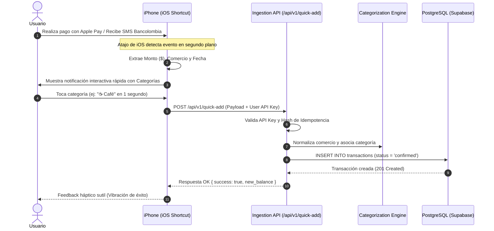
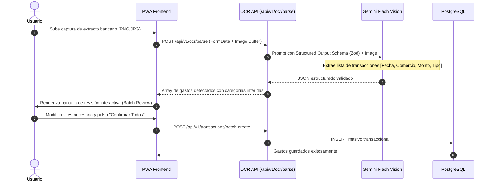

# Especificación Técnica y Arquitectura del Sistema
## ExpenseFlow (SaaS de Gestión Financiera de Cero Fricción con IA)

**Versión:** 1.0.0  
**Fecha:** 24 de Agosto de 2026  
**Estado:** Aprobado para Implementación  
**Autor:** Jean Paul Reales & AI Architecture Team  

---

## 1. Visión y Resumen Ejecutivo

### 1.1 El Problema Fundamental
El 90% de las personas que intentan llevar un registro de sus finanzas personales abandonan en las primeras dos semanas. El motivo principal es la **fricción operativa**:
- Abrir una aplicación móvil tras cada compra.
- Esperar que cargue la interfaz.
- Seleccionar cuenta, ingresar monto manualmente, buscar categoría y guardar.
- Olvidar registrar compras pequeñas ("gastos hormiga") que al final de mes descuadran el balance.

### 1.2 La Solución de ExpenseFlow
Un ecosistema financiero personal que elimina el 95% de la fricción mediante:
1. **Captura Flash (Zero-Friction Ingestion):** Intercepción automática de pagos realizados vía **Apple Pay** o **SMS bancarios (Bancolombia, etc.)** en iOS mediante Apple Shortcuts y Webhooks seguros, solicitando solo la categoría en un toque o auto-categorizando mediante reglas aprendidas.
2. **Ingesta Inteligente por Capturas de Pantalla (Vision AI):** Carga de extractos o capturas de pantalla de la app bancaria para extracción masiva de transacciones en segundos con **Gemini Flash Vision** y confirmación en 1 solo clic.
3. **Dashboard de Insights y Salud Financiera:** Visualización analítica en tiempo real (PWA de alto rendimiento) con desglose de flujo de caja, presupuestos por categoría y patrones de consumo.
4. **Mentalidad de Producto SaaS:** Diseñado desde el día uno como un sistema multi-tenant, seguro (Row Level Security), con API Keys por usuario, escalable a miles de usuarios sin refactorizaciones estructurales.

---

## 2. Pila Tecnológica (Tech Stack 2026) y Justificación

| Capa / Componente | Tecnología Seleccionada | Justificación y Ventajas |
| :--- | :--- | :--- |
| **Framework Fullstack** | **Next.js 15+ (App Router)** | Permite unificar en una sola base de código el Frontend (PWA ultra rápida con React Server Components) y el Backend (Route Handlers / Webhooks para iOS). Despliegue global en Edge/Serverless sin costes de servidor fijo. |
| **Lenguaje** | **TypeScript 5+ (Strict Mode)** | Tipado estricto de extremo a extremo, eliminando errores de tipo en tiempo de compilación para operaciones con dinero y schemas de base de datos. |
| **Estilos & UI** | **Tailwind CSS v4 + Vanilla CSS Variables** | Sistema de diseño de alto impacto visual (Glassmorphism, Modo Oscuro OLED, gradientes sutiles). Cero bundle overhead en tiempo de ejecución. |
| **Componentes e Iconos** | **Lucide Icons + Radix UI / Framer Motion** | Accesibilidad nativa, soporte para micro-animaciones fluidas y experiencia de usuario táctil que rivaliza con apps nativas. |
| **PWA & Offline** | **Serwist / Web App Manifest** | Instalación como app nativa en iOS (Add to Home Screen), ejecución a pantalla completa sin barra de navegación de Safari, soporte de caché offline. |
| **Base de Datos** | **PostgreSQL 16+ (Supabase)** | Base de datos relacional robusta con soporte ACID completo. Indispensable para consistencia transaccional financiera. |
| **Seguridad Multi-Tenant** | **PostgreSQL Row Level Security (RLS)** | Garantiza que ningún usuario pueda acceder a datos de otro a nivel de motor de base de datos, no solo a nivel de código. |
| **ORM / Data Access** | **Drizzle ORM** | ORM ligero, sin sobrecarga de memoria, 100% type-safe con inferencia automática de TypeScript y migraciones declarativas limpias. |
| **Autenticación** | **Supabase Auth** | Autenticación passwordless (Magic Links), soporte nativo para Apple Sign In y llaves de paso (Passkeys). |
| **Motor de Visión / OCR** | **Google Gemini Flash (Multimodal API)** | Procesamiento de imágenes de extractos en <1.5s, extracción estructurada mediante JSON Schema nativo, costo marginal ínfimo comparado con OCRs tradicionales. |
| **Validación de Datos** | **Zod v3** | Validación estricta de payloads entrantes de Webhooks, respuestas de IA y formularios de usuario. |

---

## 3. Arquitectura del Sistema y Patrones de Diseño

### 3.1 Estilo Arquitectónico: Clean Architecture / Modular Monolith
Se adopta una arquitectura modular por capas con separación estricta de responsabilidades:

```
src/
├── app/                        # Capa de Presentación (Next.js App Router)
│   ├── (auth)/                 # Rutas de login / onboarding
│   ├── (dashboard)/            # Vistas protegidas (Dashboard, Transacciones, OCR, Métricas)
│   ├── api/v1/                 # Endpoints REST y Webhooks (Ingesta iOS, OCR)
│   └── manifest.ts             # Manifiesto PWA para iOS
├── components/                 # Componentes UI reutilizables
│   ├── ui/                     # Primitivos de diseño (Cards, Buttons, Modals, Chips)
│   ├── dashboard/              # Gráficas, Resumen mensual, Métricas
│   └── ocr/                    # Upload zone, Batch review table
├── core/                       # Capa de Dominio y Negocio (Lógica Pura)
│   ├── domain/                 # Entidades y Tipos de Dominio
│   │   ├── transaction.ts
│   │   ├── category.ts
│   │   ├── account.ts
│   │   └── user.ts
│   └── services/               # Casos de Uso y Servicios
│       ├── ingestion.service.ts      # Manejo de webhooks y sanitización
│       ├── ocr.service.ts            # Comunicación con Gemini Flash Vision
│       ├── categorization.engine.ts  # Motor de reglas + heuristic matching
│       └── analytics.service.ts      # Agregaciones de métricas y presupuestos
├── infrastructure/             # Capa de Infraestructura (Adaptadores externos)
│   ├── db/                     # Conexión Drizzle, esquemas y migraciones
│   ├── ai/                     # Cliente Gemini Vision configurado
│   └── sms-parsers/            # Estrategias de parseo de bancos (Bancolombia, etc.)
└── lib/                        # Utilidades compartidas (Money, Dates, Idempotency)
```

### 3.2 Patrones de Diseño Aplicados

1. **Strategy Pattern (Estrategias de Parseo Bancario):**
   - Permite que el sistema acepte SMS o notificaciones de diferentes bancos (Bancolombia, Nequi, Davivienda, Nu, etc.). Cada banco implementa una interfaz `BankParserStrategy` con sus regex y reglas de normalización. Si un nuevo banco se añade, no se altera la lógica central.
2. **Rule Engine Pattern (Motor de Auto-Categorización Inteligente):**
   - Flujo de decisión en 3 niveles para asignar categoría a un gasto:
     1. *Regla exacta del usuario* (ej: "Éxito" -> "Supermercado").
     2. *Pattern matching difuso / Heurística* (ej: "Uber Eats" contiene "Uber" -> "Transporte/Comida").
     3. *Inferencia por IA (Fallback)* -> Sugerencia con confianza alta.
3. **Idempotency Token / Fingerprint Pattern:**
   - Para evitar transacciones duplicadas si un SMS llega doble o el atajo de iOS reintenta la petición. Se genera un hash: `SHA256(user_id + amount_cents + merchant_normalized + timestamp_window_10min)`. Si ya existe en la base de datos, la petición se reconoce como exitosa pero no duplica el egreso.
4. **Unit of Work & Repository Pattern (vía Drizzle ORM):**
   - Aislamiento de las consultas SQL directas de la capa de presentación.

---

## 4. Flujo de Datos y Diagramas de Secuencia

### 4.1 Flujo de Captura Flash en iOS (Apple Pay & SMS)



### 4.2 Flujo de Ingesta Masiva por Capturas de Pantalla (OCR Vision)



---

## 5. Modelo de Datos Relacional y Esquema SQL

### 5.1 Esquema de Base de Datos

```sql
-- Habilitar extensión UUID
CREATE EXTENSION IF NOT EXISTS "uuid-ossp";

-- 1. Tabla de Usuarios (Extensión del Auth de Supabase)
CREATE TABLE public.profiles (
    id UUID PRIMARY KEY REFERENCES auth.users(id) ON DELETE CASCADE,
    email TEXT NOT NULL,
    full_name TEXT,
    currency_default VARCHAR(3) NOT NULL DEFAULT 'COP',
    timezone TEXT NOT NULL DEFAULT 'America/Bogota',
    api_key VARCHAR(64) UNIQUE NOT NULL DEFAULT encode(gen_random_bytes(32), 'hex'),
    created_at TIMESTAMPTZ NOT NULL DEFAULT NOW(),
    updated_at TIMESTAMPTZ NOT NULL DEFAULT NOW()
);

-- 2. Cuentas Financieras (Bancolombia, Efectivo, Apple Card, etc.)
CREATE TABLE public.accounts (
    id UUID PRIMARY KEY DEFAULT uuid_generate_v4(),
    user_id UUID NOT NULL REFERENCES public.profiles(id) ON DELETE CASCADE,
    name VARCHAR(100) NOT NULL,
    type VARCHAR(30) NOT NULL CHECK (type IN ('checking', 'credit_card', 'savings', 'cash', 'digital_wallet')),
    currency VARCHAR(3) NOT NULL DEFAULT 'COP',
    initial_balance_cents BIGINT NOT NULL DEFAULT 0,
    current_balance_cents BIGINT NOT NULL DEFAULT 0,
    color VARCHAR(20) DEFAULT '#3B82F6',
    is_archived BOOLEAN NOT NULL DEFAULT FALSE,
    created_at TIMESTAMPTZ NOT NULL DEFAULT NOW()
);

-- 3. Categorías de Gastos / Ingresos
CREATE TABLE public.categories (
    id UUID PRIMARY KEY DEFAULT uuid_generate_v4(),
    user_id UUID NOT NULL REFERENCES public.profiles(id) ON DELETE CASCADE,
    name VARCHAR(80) NOT NULL,
    icon VARCHAR(50) NOT NULL DEFAULT 'Tag',
    color VARCHAR(20) NOT NULL DEFAULT '#6B7280',
    type VARCHAR(10) NOT NULL CHECK (type IN ('expense', 'income')),
    monthly_budget_cents BIGINT DEFAULT NULL,
    is_system_default BOOLEAN NOT NULL DEFAULT FALSE,
    created_at TIMESTAMPTZ NOT NULL DEFAULT NOW()
);

-- 4. Transacciones Financieras
CREATE TABLE public.transactions (
    id UUID PRIMARY KEY DEFAULT uuid_generate_v4(),
    user_id UUID NOT NULL REFERENCES public.profiles(id) ON DELETE CASCADE,
    account_id UUID REFERENCES public.accounts(id) ON DELETE SET NULL,
    category_id UUID REFERENCES public.categories(id) ON DELETE SET NULL,
    amount_cents BIGINT NOT NULL, -- Siempre en enteros positivos
    type VARCHAR(10) NOT NULL CHECK (type IN ('expense', 'income', 'transfer')),
    merchant VARCHAR(255) NOT NULL,
    note TEXT,
    transaction_date TIMESTAMPTZ NOT NULL,
    source VARCHAR(30) NOT NULL CHECK (source IN ('apple_pay', 'sms_shortcut', 'ocr_screenshot', 'manual', 'csv_import')),
    idempotency_hash VARCHAR(64),
    receipt_image_url TEXT,
    created_at TIMESTAMPTZ NOT NULL DEFAULT NOW(),
    updated_at TIMESTAMPTZ NOT NULL DEFAULT NOW()
);

-- 5. Reglas de Auto-Categorización de Comercios
CREATE TABLE public.categorization_rules (
    id UUID PRIMARY KEY DEFAULT uuid_generate_v4(),
    user_id UUID NOT NULL REFERENCES public.profiles(id) ON DELETE CASCADE,
    category_id UUID NOT NULL REFERENCES public.categories(id) ON DELETE CASCADE,
    merchant_pattern VARCHAR(255) NOT NULL, -- Regex o substring ej: 'd1|tiendas d1|exito'
    is_regex BOOLEAN NOT NULL DEFAULT FALSE,
    created_at TIMESTAMPTZ NOT NULL DEFAULT NOW()
);

-- Índices de Rendimiento
CREATE INDEX idx_transactions_user_date ON public.transactions(user_id, transaction_date DESC);
CREATE INDEX idx_transactions_idempotency ON public.transactions(user_id, idempotency_hash);
CREATE INDEX idx_categories_user ON public.categories(user_id);
CREATE INDEX idx_accounts_user ON public.accounts(user_id);

-- Row Level Security (RLS) Policies
ALTER TABLE public.profiles ENABLE ROW LEVEL SECURITY;
ALTER TABLE public.accounts ENABLE ROW LEVEL SECURITY;
ALTER TABLE public.categories ENABLE ROW LEVEL SECURITY;
ALTER TABLE public.transactions ENABLE ROW LEVEL SECURITY;
ALTER TABLE public.categorization_rules ENABLE ROW LEVEL SECURITY;

CREATE POLICY "Users can only access their own profile" ON public.profiles FOR ALL USING (auth.uid() = id);
CREATE POLICY "Users can only access their own accounts" ON public.accounts FOR ALL USING (auth.uid() = user_id);
CREATE POLICY "Users can only access their own categories" ON public.categories FOR ALL USING (auth.uid() = user_id);
CREATE POLICY "Users can only access their own transactions" ON public.transactions FOR ALL USING (auth.uid() = user_id);
CREATE POLICY "Users can only access their own rules" ON public.categorization_rules FOR ALL USING (auth.uid() = user_id);
```

---

## 6. Manejo de Casos Extremos y Fiabilidad Financiera

| Desafío Técnico | Solución de Ingeniería |
| :--- | :--- |
| **Precisión Monetaria** | **Prohibición estricta de tipos `float`/`double`.** Todos los montos se almacenan como enteros `amount_cents` (`$45.000` = `4500000`). Las conversiones se realizan solo en la capa de formateo visual (`Intl.NumberFormat`). |
| **Zonas Horarias** | Almacenamiento universal en **UTC ISO-8601** en la base de datos. Conversión a la zona horaria del usuario (`America/Bogota`) en el cliente o mediante transformaciones de fecha en el servicio de analíticas. |
| **Resiliencia de SMS Bancarios** | Estrategia híbrida: si el regex local del SMS falla por cambios de redacción de Bancolombia, el backend pasa el texto crudo a Gemini Flash con un prompt ligero de extracción en <200ms para no perder la transacción. |
| **Duplicados por Reintentos** | **Hash de Idempotencia:** `sha256(userId + amount + normalize(merchant) + roundToHour(date))`. El backend descarta o fusiona transacciones duplicadas generadas en un rango menor a 15 minutos. |

---

## 7. Roadmap y Fases de Construcción

```
FASE 1: Fundaciones & Base de Datos
 ├── Setup de Next.js 15, Tailwind v4, Drizzle ORM y Supabase.
 ├── Creación de esquemas SQL con RLS y scripts de seed inicial.
 └── Configuración del sistema de diseño (Dark theme, Tokens).

FASE 2: Ingesta de Cero Fricción (iOS Shortcuts + Webhook)
 ├── Endpoint seguro `/api/v1/quick-add` con validación por API Key.
 ├── Motor de reglas de categorización automática.
 └── Configuración del archivo de Atajo de iOS para Apple Pay y SMS Bancolombia.

FASE 3: Motor de Visión IA para Capturas (OCR Ingestion)
 ├── Endpoint `/api/v1/ocr/parse-statement` con Gemini Flash.
 ├── Interfaz de subida con drag-and-drop y procesamiento en tiempo real.
 └── UI de revisión interactiva por lotes (Batch Review & Approve).

FASE 4: Dashboard, Analytics & PWA
 ├── Gráficos interactivos de flujo de caja y distribución de egresos.
 ├── Gestión de categorías, cuentas y presupuestos mensuales.
 ├── PWA Manifest + Service Worker para instalación nativa en iPhone.
 └── Modo multi-usuario listo para monetización SaaS.
```

---

## 8. Conclusión

Este documento establece las bases definitivas para construir una plataforma financiera rápida, moderna y preparada para escalar. Al priorizar la **cero fricción en la captura de datos** mediante iOS Shortcuts y la **extracción visual por IA**, resolvemos la principal causa de fracaso de las apps financieras convencionales.
